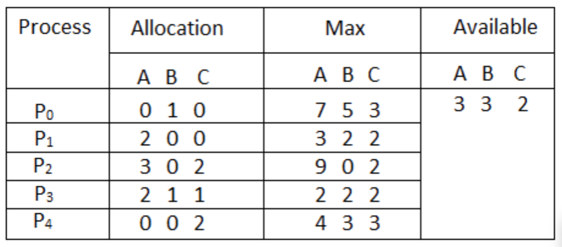

# Banker's Algorithm for deadlock avoidance

## Program
This project contains a single .cpp file.
The program will use the Banker's Algorithm to ensure that there is no deadlock.
An example is given. A text document is read which sets up the correct matrices.
It will then check if the sequence is safe or will cause deadlock.
If the system is in an unsafe state it returns saying "not safe".
If it is safe it will also provide the safe sequence.
In terms of creating your own txt file, please follow the format of
```
// Allocation
...
// Max
...
// Available
...
```
or else it will not work

## Problems
The only problems that could arise is giving the incorrect arguments.

## Compiling and Running
```
g++ banker.cpp -o banker
./banker .txt n m
```

the process takes 3 arguments.
the first is the .txt file with the matrices for allocation, max, and available
the n is the number of processes 
and m is the number of resource types

## Example



This is an example state 
it is a system with five processes P0 through P4 and three resources of type A, B, C. Resource type A has 10 instances, B has 5 instances and type C has 7 instances.

to run this example
```
./banker ex.txt 5 3

Safe, order is
P1
P3
P4
P0
P2
```
